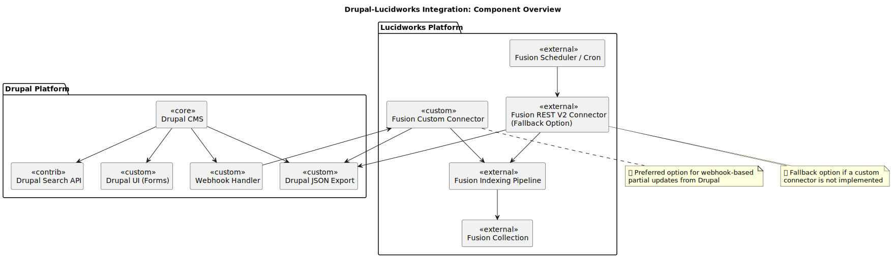

# 🧠 Lucidworks + Drupal Architecture Diagrams  
_Visual UML/PlantUML Source of Truth for the Cosmos Project_

---

## ✅ Purpose

This repository contains **version-controlled architecture diagrams** in `.puml` format for ingestion, search, and component flows between Drupal and Lucidworks.

Diagrams are organized and documented for easy integration with:
- ✅ GitHub Pages (static viewable links)
- ✅ Docsify (future embedded documentation site)
- ✅ 🧠 Miro/Confluence (via iframe or copy-paste of `.puml` blocks)

---

## 📁 Folder Structure

```
docs/
└── lucidworks/
    ├── component/                 # High-level static components
    │   └── COMP-001--*.puml
    ├── sequence-diagrams/        # Flow diagrams (ingestion/search)
    │   ├── ingestion/
    │   │   └── ING-001--*.puml
    │   └── search/
    │       └── SRCH-001--*.puml
    └── use-case/
        └── UC-001--*.puml
```

---

## ✍️ Diagram Metadata Convention

Each `.puml` file **must begin with metadata** in this format:

```plantuml
/' 
@id: ING-001
@file: ING-001--admin-ui-trigger.puml
@title: Admin Manual Trigger via Drupal UI
@type: sequence
@description: Shows how a Drupal admin triggers a Fusion indexing job via a UI button.
@related: ING-002, ING-003, ING-004
'/
```

💡 This allows easy indexing and linking between diagrams.

---

## 🎯 Diagram Naming Rules

Each file name follows:

```
<ID>--<short-name>.puml
```

Examples:
- COMP-001--drupal-lucidworks-architecture.puml
- ING-002--drush-trigger.puml
- SRCH-004--multi-collection-search.puml

---

## 🧪 Preview Locally (VSCode)

Install the [PlantUML extension](https://marketplace.visualstudio.com/items?itemName=jebbs.plantuml) for VSCode and Java if prompted.

Then right-click a `.puml` file → "Preview Current Diagram."

---

## 🚀 Deploy to GitHub Pages

1. Go to **Repository → Settings → Pages**
2. Set Source = `main`, Folder = `/docs`
3. After saving, GitHub will show your link like:

```
https://your-username.github.io/your-repo-name/
```

---

## 📚 Future Plans

| Feature                            | Status     |
|------------------------------------|------------|
| GitHub Pages                       | ✅ Working |
| Docsify integration                | 🕐 Planned |
| Iframe embedding (Miro/Confluence) | ✅ Possible |
| Diagram index table                | 🕐 Planned |
| CI auto-gen of SVGs                | 🕐 Optional |


### Drupal Lucidworks Architecture

